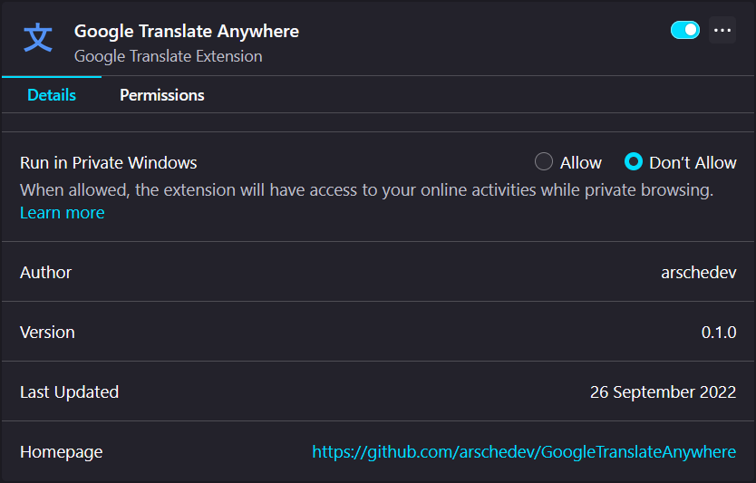

# 🧩 Google Translate Anywhere
###### 文 Google Translate add-on for Mozilla Firefox
> 🚧 In development

## 📄 Manual installation 
1. Make sure [Node.js](https://nodejs.org) is installed
2. Download repository
3. Go to project root directory (with *manifest.json* file)
4. Open Terminal or cmd
5. Run `npm install` to install dependencies
6. Run `npm run dev`, a firefox browser window will open with preinstalled extension.  
   (If an error occurs, try running `npm run ig`, then run `npm run dev` again)  

 

> Previously — [arschedev/AddGoogleTranslate](https://github.com/arschedev/AddGoogleTranslate)
